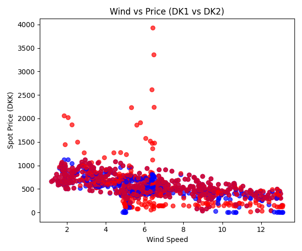
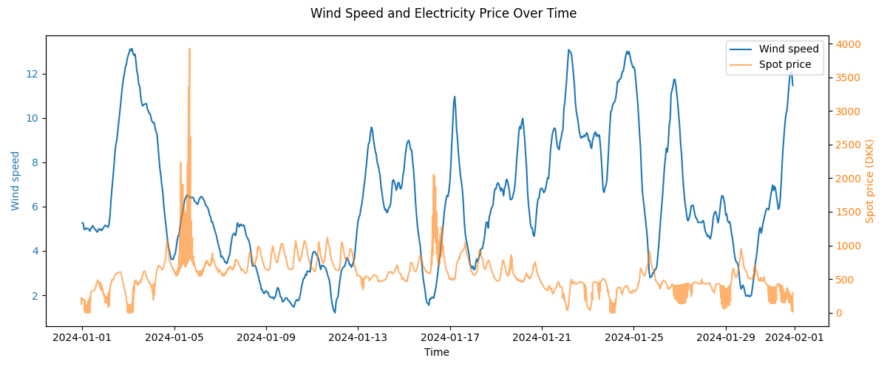

# Energy Mismatch Analysis (Denmark)

Data project analysing the relationship between electricity production, consumption, prices and renewable energy in Denmark.

## Key results
- Higher share of renewable energy → lower electricity prices  
- Clear negative correlation between supply surplus and price  
- DK1 (West) tends to have surplus, DK2 (East) deficit  
- Strong price volatility in DK2 indicates higher dependency on imports  
- Wind speed strongly increases renewable production  
- Wind has a clear negative impact on electricity prices  
- The impact of wind on prices is significantly stronger in DK1 than DK2  
- No significant lag between wind and price, indicating efficient market pricing  

## Tech stack
Python (pandas), Power BI, Energinet API, DMI API

---

## Analyse af energimismatch og elpriser i Danmark

Analyse af mismatch mellem energiproduktion og forbrug i Danmark samt sammenhængen med elpriser, vedvarende energi og vejrdata.  
Data er behandlet i Python og visualiseret i Power BI.

## Data
- Energinet API  
- Elspotprices  
- ProductionConsumption  
- DMI (vejrdata: vind, temperatur, sol)

## Metode
- Data ingestion og behandling i Python  
- Merge på HourUTC + PriceArea  
- Integration af vejrdata (timebaseret)  
- Feature engineering:
  - mismatch (produktion - forbrug)  
  - renewable_share (andel vedvarende energi)  
- Visualisering og analyse i Power BI  
- Interactive dashboard built in Power BI (see /powerbi folder)

## Insights

### Insight 1 – Mismatch vs pris
Der er en tydelig negativ sammenhæng mellem mismatch og elpris (corr ≈ -0.42), hvilket indikerer, at overskud af strøm presser priserne ned.

### Insight 2 – Renewable vs pris
Vedvarende energikilder har en endnu stærkere negativ sammenhæng med elpriser (corr ≈ -0.57), hvilket viser, at sammensætningen af produktionen er central for prisdannelsen.

### Insight 3 – Geografi
Vestdanmark (DK1) har systematisk overskud (gennemsnit ≈ +490 MWh), mens Østdanmark (DK2) har underskud (≈ -388 MWh), hvilket understreger behovet for energiflow mellem områder.

### Insight 4 – Mismatch over tid
Elsystemet er dynamisk med store udsving (fra ca. -1972 til +2759 MWh).  
Underskud ses typisk i dagtimerne, mens overskud opstår om aftenen og natten.

### Insight 5 – Grøn energi vs pris
Der ses en tydelig negativ sammenhæng mellem andelen af vedvarende energi og elpriser.  
Østdanmark (DK2) viser større prisudsving, hvilket tyder på højere afhængighed af import.

---

## Nye insights (vejrbaseret analyse)

### Insight 6 – Vind driver produktion
Vindhastighed har en stærk positiv sammenhæng med vedvarende produktion (corr ≈ 0.65).  
Dette bekræfter, at vind er den dominerende driver for grøn energiproduktion i Danmark.

### Insight 7 – Vind påvirker elpriser
Vind har en tydelig negativ effekt på elpriser (corr ≈ -0.50).  
Når vinden stiger, øges udbuddet af billig strøm, hvilket presser priserne ned.

### Insight 8 – Regional forskel (DK1 vs DK2)
Effekten af vind på priser er væsentligt stærkere i DK1 (≈ -0.62) end i DK2 (≈ -0.44).  
Dette afspejler den højere koncentration af vindproduktion i Vestdanmark.

### Insight 9 – Effektiv prissætning
Der ses ingen væsentlig lag-effekt mellem vind og pris.  
Det indikerer, at markedet hurtigt indregner ændringer i vindforhold i elpriserne.

### Insight 10 – Temperatur og efterspørgsel
Temperatur har en svag negativ sammenhæng med forbrug (corr ≈ -0.11), hvilket tyder på, at koldere vejr øger energiefterspørgslen.

### Insight 11 – Solens begrænsede effekt (vinter)
Solindstråling har minimal effekt på produktion i analyseperioden (januar), hvilket understreger vindens dominans i vintermånederne.

---

## Business value
The analysis shows how energy consumption can be shifted to periods with high renewable production, reducing both cost and CO₂ footprint.  
It also highlights how weather-driven production impacts pricing differently across regions, which is relevant for energy planning, trading and optimisation.

---

## Visualiseringer

### Elbalance over tid

### Elpris vs andel vedvarende energi

### Wind vs Price (DK1 vs DK2)

### Wind and Price Over Time
