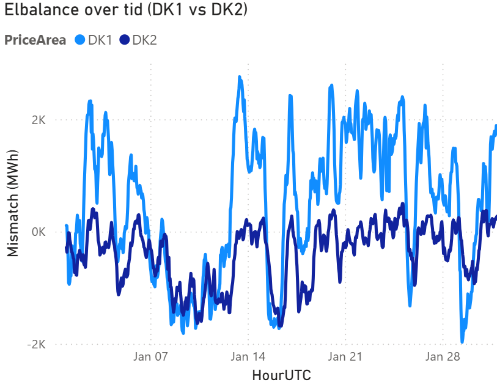
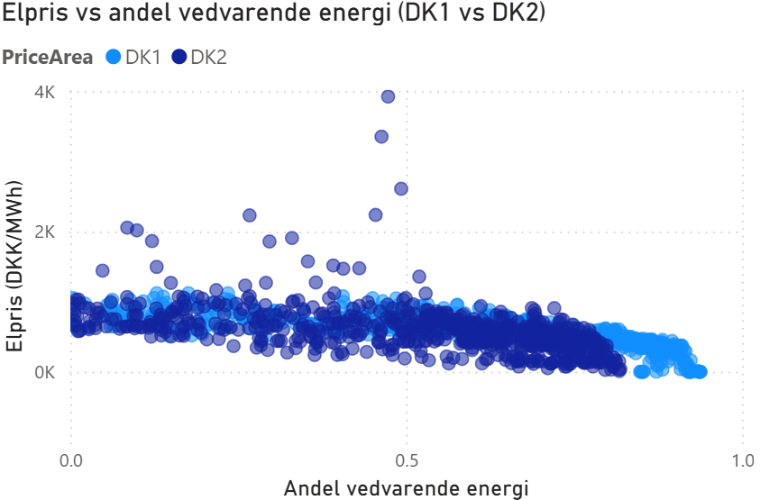

# Energy Mismatch Analysis (Denmark)

Data project analysing the relationship between electricity production, consumption, prices and renewable energy in Denmark.

## Key results
- Higher share of renewable energy → lower electricity prices  
- Clear negative correlation between supply surplus and price  
- DK1 (West) tends to have surplus, DK2 (East) deficit  
- Strong price volatility in DK2 indicates higher dependency on imports  

## Tech stack
Python (pandas), Power BI, Energinet API

---

## Analyse af energimismatch og elpriser i Danmark

Analyse af mismatch mellem energiproduktion og forbrug i Danmark samt sammenhængen med elpriser og vedvarende energi.  
Data er behandlet i Python og visualiseret i Power BI.

## Data
- Energinet API  
- Elspotprices  
- ProductionConsumption  

## Metode
- Data ingestion og behandling i Python  
- Merge på HourUTC + PriceArea  
- Feature engineering:
  - mismatch (produktion - forbrug)  
  - renewable_share (andel vedvarende energi)  
- Visualisering og analyse i Power BI  
- Interactive dashboard built in Power BI (see /powerbi folder)

## Insights

### Insight 1 – Mismatch vs pris
Der er en tydelig negativ sammenhæng mellem mismatch og elpris, hvilket indikerer, at overskud af strøm presser priserne ned.

### Insight 2 – Renewable vs pris
Vedvarende energikilder har en stærkere påvirkning på elpriser end det samlede mismatch mellem produktion og forbrug, hvilket understreger betydningen af energikildens sammensætning i prisdannelsen.

### Insight 3 – Geografi
Vestdanmark (DK1) har systematisk overskud, mens Østdanmark (DK2) har underskud, hvilket indikerer behov for energiflow eller import.

### Insight 4 – Mismatch over tid
Elsystemet er dynamisk med betydelige udsving i balancen mellem produktion og forbrug, hvilket understreger behovet for fleksibilitet, lagring og styring af efterspørgsel.

### Insight 5 – Grøn energi vs pris
Der ses en tydelig negativ sammenhæng mellem andelen af vedvarende energi og elpriser, hvor høj produktion fra vind og sol presser priserne ned.  
Samtidig fremstår Østdanmark (DK2) med større prisudsving, hvilket tyder på en højere afhængighed af import og eksterne markedsforhold.

## Business value
The analysis shows how energy consumption can be shifted to periods with high renewable production, reducing both cost and CO₂ footprint.

## Visualiseringer

### Elbalance over tid

### Elpris vs andel vedvarende energi
