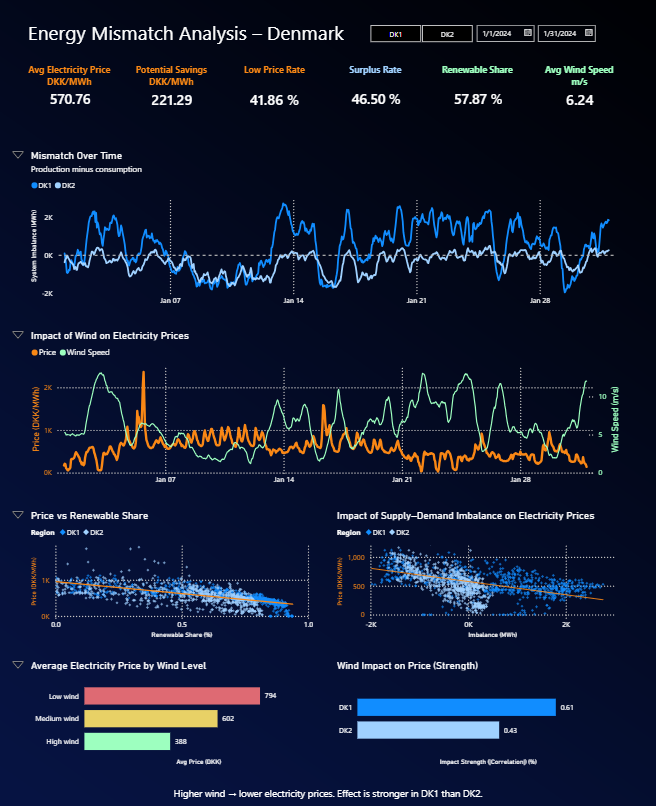
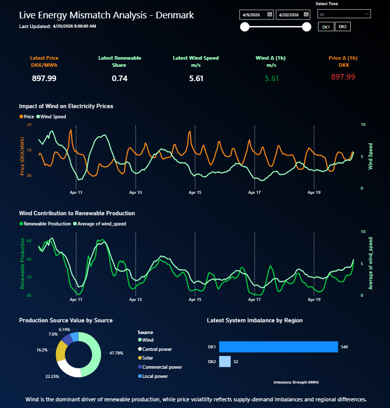

# Energy Mismatch Analysis (Denmark)

End-to-end data project analysing how electricity production, consumption, weather and market dynamics interact in Denmark — with both historical analysis and a live data pipeline.

## TL;DR
- Renewable energy significantly lowers electricity prices  
- Wind is the dominant driver of renewable production and price movements  
- Supply-demand imbalance strongly explains price volatility  
- DK1 (West) consistently has surplus, DK2 (East) deficit  
- Built a live pipeline + dashboard to track these effects in near real-time  

---

## Tech Stack
- Python (pandas, requests, sqlite3)  
- Power BI  
- SQLite  
- REST APIs (Energinet, DMI)  

## Key Results

### Market dynamics
- Strong negative correlation between supply surplus and price (≈ -0.42)  
- Renewable share has even stronger impact on price (≈ -0.57)  
- Clear price volatility in DK2 indicates dependency on imports  
- No meaningful lag between production and price → efficient market pricing  

### Wind & weather impact
- Wind strongly increases renewable production (corr ≈ +0.65)  
- Wind reduces electricity prices (corr ≈ -0.50)  
- Stronger price impact in DK1 (≈ -0.61) vs DK2 (≈ -0.43)  
- Higher wind → lower average price:
  - Low wind: ~794 DKK/MWh  
  - Medium wind: ~602 DKK/MWh  
  - High wind: ~388 DKK/MWh  

### System behaviour
- DK1: consistent surplus (~ +490 MWh)  
- DK2: consistent deficit (~ -388 MWh)  
- Imbalance ranges roughly from -2000 to +2700 MWh  
- Prices decrease as imbalance increases (clear downward trend in scatter)

---

## Live Dashboard Insights (Real-time layer)

Built a live pipeline and dashboard to monitor system behaviour continuously.

### Current snapshot (example)
- Electricity price: ~898 DKK/MWh  
- Renewable share: ~74%  
- Wind speed: ~5.6 m/s  
- DK1 imbalance: ~+540 MWh  
- DK2 imbalance: ~+52 MWh  

### Observations from live data
- Wind spikes are immediately reflected in price drops  
- Renewable production closely follows wind patterns  
- Price volatility aligns with supply-demand imbalance  
- Wind dominates renewable mix (~48% of total production)

---

## Architecture

### Data pipeline (Python)
- Fetches energy + price data from Energinet API  
- Fetches weather data (wind, temperature, solar) from DMI API  
- Merges datasets on hourly timestamps  
- Stores data in SQLite  
- Exports clean dataset for Power BI  

Pipeline flow:
Fetch energy → Fetch weather → Merge → Store → Export → Dashboard


Key features:
- Hourly resolution
- Automatic cleanup of old data (rolling window)
- Structured feature engineering:
  - mismatch = production - consumption  
  - renewable_share  
  - wind / solar breakdown  
- Centralised orchestration script

---

## Data Sources
- Energinet API (production, consumption, prices)  
- DMI API (wind speed, temperature, solar radiation)  

---

## Methodology
- Data ingestion and cleaning in Python  
- Time alignment (hourly granularity)  
- Feature engineering:
  - supply-demand mismatch  
  - renewable share  
  - production source breakdown  
- Weather integration (wind, temperature, solar)  
- Visualisation and analysis in Power BI  

---

## Business Value

This project demonstrates how data can be used to:

- Identify when electricity is cheapest → optimise consumption timing  
- Understand how renewable energy impacts market prices  
- Support energy trading and forecasting decisions  
- Highlight regional imbalances in energy systems  
- Connect external factors (weather) to operational outcomes  

---

## Dashboards

### Historical Analysis Dashboard


- Mismatch over time  
- Wind vs price (time series)  
- Price vs renewable share (scatter)  
- Supply-demand imbalance vs price  
- Wind impact by region  

### Live Monitoring Dashboard


- Real-time price, wind and renewable metrics  
- Live imbalance tracking (DK1 vs DK2)  
- Wind → production relationship  
- Production mix (donut chart)  

---

## Example Visuals

### Mismatch over time


### Renewable share vs price


### Wind vs price


---

## Conclusion

The Danish electricity market is highly responsive to renewable production — especially wind.  
Price formation is strongly driven by supply-demand balance, and weather acts as a key external driver.

This project shows how combining multiple data sources into a structured pipeline enables both deep analysis and real-time decision support.

## How to run

```bash
# 1. Install dependencies
pip install -r requirements.txt

# 2. Initialize database (first time only)
python init_live_database.py

# 3. Run pipeline (fetch + process + export)
python run_live_pipeline.py
```